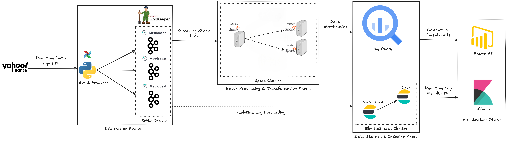
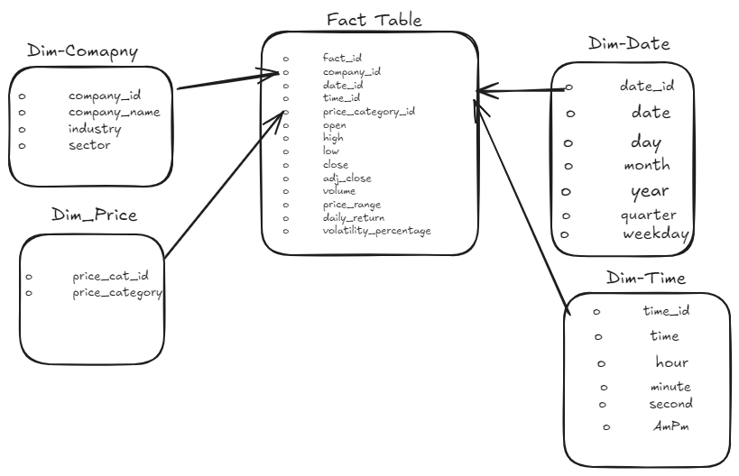

# 📈 Real-Time Stock Market Analytics





## 🌟 Overview
This project implements a comprehensive stock market analytics pipeline, integrating real-time data streaming and batch processing. The system is designed to process stock data every five minutes and perform daily batch processing using various technologies, including Kafka, PySpark, and BigQuery.
## 📂 Folder Structure
```plaintext
stock-market-analytics/
├── stock-stream-api/          # Flask API simulating real-time stock data generation
├── airflow/                   # Airflow DAGs and configuration files
├── kafka/                     # Kafka setup and configuration files (3-node cluster)
├── zookeeper/                 # Zookeeper setup and configuration files (3-node cluster)
├── elasticsearch/             # Elasticsearch setup and indices configuration
├── kibana/                    # Kibana dashboards and configurations
├── pyspark/                   # PySpark scripts for batch processing and analysis
├── bigquery/                  # BigQuery dataset schemas and query files
├── dashboards/                # Power BI or other dashboard reports
├── systemd-services/          # Systemd service files for automation of services
├── architecture_diagrams/     # Diagrams and architectural overviews
```

## ⚙️ Technologies Used
- **Flask**: For building the API to simulate stock data.
- **Airflow**: For orchestrating workflows, enabling real-time ingestion every 5 minutes and daily ingestion.
- **Kafka**: For real-time data streaming.
- **Spark**: For both real-time processing (streaming) and daily batch processing.
- **BigQuery**: For scalable data warehousing.
- **Power BI**: For visualizing real-time insights and daily insights.
- **Metricbeat**: For collecting Kafka and system utilization metrics.
- **Elasticsearch**: For storing log data and facilitating searching and analyzing large datasets.
- **Kibana**: For visualizing log data stored in Elasticsearch.

## 🚀 Getting Started
### Prerequisites
Before you begin, ensure you have the following installed:
- Python 3.x
- Kafka
- Spark
- Elasticsearch
- Airflow

### Installation
1. **Clone the repository**:
   ```bash
   git clone https://github.com/your-username/stock-market-analytics.git
   cd stock-market-analytics
   ```

2. **Set up the environment** (if using a virtual environment):
   ```bash
   python -m venv venv
   source venv/bin/activate  # On Windows use `venv\Scripts\activate`
   ```

3. **Install dependencies**:
   ```bash
   pip install -r requirements.txt
   ```
   
## 🤝 Contributing
Contributions are welcome! Please follow these steps:
1. Fork the repository.
2. Create your feature branch:
   ```bash
   git checkout -b feature/YourFeature
   ```
3. Commit your changes:
   ```bash
   git commit -m "Add your feature"
   ```
4. Push to the branch:
   ```bash
   git push origin feature/YourFeature
   ```
5. Open a pull request.

## 📄 License
This project is licensed under the MIT License.

## 🛠️ Acknowledgments
- Developed by Omar Shaker, Shorook Ibrahim, and Abeer Omar.
- Inspired by various data engineering projects and tutorials.
- Thanks to the open-source community for their invaluable resources.
